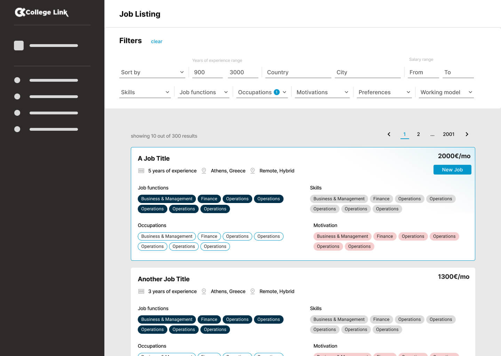

# LinQ Front-end Developer Assessment

👋 Hi there! We're thrilled that you're interested in joining our team as a front-end developer. This assessment is crafted to let your skills shine through practical written responses and coding exercises. Here’s what to expect:

1. Written Responses: Share your insights and experiences, and let us into your thought process on front-end development challenges.
2. Coding Exercise: Roll up your sleeves and create a mini CRUD app centered around job skills.

**How to Complete the Assessment**

To get started, just follow these steps:

1. Clone this repository, or if we provided a compressed folder, decompress it.
2. Work on the questions and coding challenge.
3. Use npm run json-server for the challenge.
4. When done, create a new Git repo named [your-name]-linq-assessment.
5. Send the repo link to tech@collegelink.gr.

We estimate a proficient front-end developer might need approximately 6-8 hours of focused coding time to comfortably complete this assessment. We completely understand everyone has their own pace and method, so take the time you need within the week allotted to do your best work, we hope you have fun!

**_We value your time and talent in completing this assessment and look forward to seeing your unique approach!_**

## 📝 Part 1: Written

This part of the assessment is theoretical and will test your understanding of the front-end development process,and see your problem-solving in action!

_*Don’t sweat over your syntax or dictionary — we're only interested in your ability to convey coding concepts and collaborate.*_

### Plan Before You Code

Above is a design for a dynamic Job Listing page. We're curious about your strategy for turning this design into functional HTML. Take a moment to consider the filtering functionality and envision how it would come to life in code. Imagine being given this design to transform into an interactive HTML template. **Before jumping into coding**, we’d love for you to share your initial game plan with us.

**Considerations :**

-   What clarifications would you need before diving into coding?
-   How might you handle saving and sharing filter states?
-   How would you ensure the smallest design elements are captured?
-   Any obstacles you anticipate? How would you address them?
-   What stack would you use and why?
-   What folder structure would you create for you project?

**Submitting:**
To submit this answer, go to `/written/question.md` or create a file in that directory folder (.txt format is also acceptable)

## 💻 Part 2: Coding Exercice

Let's Dive into the Coding Assessment! Here's What Matters:

-   Accuracy and Completeness: Did you cover all task requirements?
-   Code Quality and Format: Is your code easy to read and follow, following best practices?

**Preprocessors and Frameworks**

You don't need anything fancy for these tasks. All you need is a solid understanding of HTML, CSS, and JavaScript.

JavaScript: Stick to plain vanilla JavaScript. You can use tools like Alpine if needed, keeping things simple and straightforward.

CSS: You have options. Stick to basic CSS or level up with preprocessors like SASS, SCSS, or PostCSS. The choice is yours!

_While we highly value a strong understanding of fundamentals such as JavaScript, CSS, and HTML, if you prefer, you can utilize minimalist libraries like Alpine via CDN. However, we recommend avoiding libraries that introduce high levels of abstraction like jQuery. This allows us to assess your proficiency in fundamental concepts._

### Exercise: Creating a CRUD APP

#### 1. Job Listing Page

In this assessment part, use JavaScript and Fetch API to fetch and display job data in the UI. Start with the provided HTML skeleton in /exercise/job-listing.html.

**Job Listing Page Requirements**:

1. Fetch job data on load.
2. Show all data.
3. Add a create job button.
4. Display jobs as cards per designs.
5. Order jobs from latest to oldest.
6. Mark the latest job with a 'Latest Job' chip.
7. Make each card clickable to edit in a new page.
8. Match the designs as closely as you can.

#### **Helper Info**

---

| **Endpoint**               | **Method** | **Reason**            |
| -------------------------- | ---------- | --------------------- |
| http://localhost:3000/jobs | GET        | To fetch all job data |

---

| **Job Data Keys** | **Types**                  |
| ----------------- | -------------------------- |
| id                | Number                     |
| jobTitle          | String                     |
| yearsOfExperience | Number                     |
| salary            | Number                     |
| skills            | Array of Skill objects     |
| createdDate       | String (formatted as date) |

---

#### 2. Edit Job Page

In this phase, we'll utilize the ID from the previously selected job to fetch its specific data and prepopulate the form. Once again, you can start with the provided HTML skeleton in `/exercise/job.html.`

**Edit Job Page Requirements**

1. Fetch job data upon loading.
2. Populate the form with default data.
3. Dynamically populate select input with correct options from skills endpoint.
4. Ensure each input is of the correct type.
5. Upon form submission, send a PATCH request to update the data.
6. Clicking the delete button should remove the current entry and redirect the user to the listing page.
7. Aim to closely match the designs provided.

#### **Helper Info**

| **Endpoint**                   | **Method** | **Reason**                               |
| ------------------------------ | ---------- | ---------------------------------------- |
| http://localhost:3000/jobs/:id | GET        | To fetch single job data                 |
| http://localhost:3000/skills/  | GET        | To fetch all skills and populate options |
| http://localhost:3000/jobs/:id | PATCH      | To edit a job entry                      |
| http://localhost:3000/jobs/:id | DELETE     | Bye Bye job entry                        |

---

| **Job Data Keys** | **Types**                  |
| ----------------- | -------------------------- |
| id                | String                     |
| jobTitle          | String                     |
| yearsOfExperience | Number                     |
| salary            | Number                     |
| skills            | Array of Skill objects     |
| createdDate       | String (formatted as date) |

---

| **Skills Keys** | **Types** |
| --------------- | --------- |
| id              | String    |
| name            | String    |

---

#### 3. Create Job Page

In this part of the assessment, users should be able to create a new job using `/exercise/job-create.html`

**Create Job Page Requirements**

1. Accept user input for job creation.
2. Dynamically populate select input with correct options.
3. Upon form submission, send a POST request to create the data.
4. Aim to match the provided designs as closely as possible.

#### **Helper Info**

| **Endpoint**                  | **Method** | **Reason**                               |
| ----------------------------- | ---------- | ---------------------------------------- |
| http://localhost:3000/skills/ | GET        | To fetch all skilss and populate options |
| http://localhost:3000/jobs/   | POST       | To create a job entry                    |

---

| **Job Data Keys** | **Types**                  |
| ----------------- | -------------------------- |
| id                | String                     |
| jobTitle          | String                     |
| yearsOfExperience | Number                     |
| salary            | Number                     |
| skills            | Array of Skill objects     |
| createdDate       | String (formatted as date) |

---

| **Skills Keys** | **Types** |
| --------------- | --------- |
| id              | String    |
| name            | String    |

---

**Tips**

-   **DRY (Don't Repeat Yourself):** Look for opportunities to avoid repetition in your code, making it modular and reusable.
-   **Design Fidelity:** Strive to closely match the provided design.
-   **Code Cleanliness:** Keep your code clean and easy to understand.
-   **Run Locally:** Test your code locally to ensure smooth operation.
-   **Responsive Behavior:** Ensure your form works well across different devices.
-   **Data Handling:** Show off your skills in handling form data effectively.
-   **ID-Driven Data Fetching:** Utilize URL parameters to pre-populate form data.

## 🛠️ Development Instructions

1. Start by running `npm install` to install dependencies.
2. To serve the API locally, execute the command `npm run json-server`. This command will read from `/data/db.json` and create endpoints for the structure as an API, corresponding to first-level items.

## 🌐 Endpoints

You can check the [documentation for json-server](https://www.npmjs.com/package/json-server) But basically by running `npm run json-server` you'll get the following routes:

|        |           |
| ------ | --------- |
| GET    | /jobs     |
| GET    | /jobs/:id |
| POST   | /jobs     |
| PATCH  | /jobs/:id |
| DELETE | /jobs/:id |

|     |         |
| --- | ------- |
| GET | /skills |

**These endpoints are usually accessible at http://localhost:3000 unless the port is occupied. You can also visit http://localhost:3000/ in your browser to make sure your db.json is set.**

## 🔗 Figma Designs

[![figma-badge]][figma-link]

For your convenience you can also refer to the Figma designs.

[figma-badge]: https://img.shields.io/badge/figma-View_Designs-%23000000.svg?style=for-the-badge&logo=figma&logoColor=white
[figma-link]: https://www.figma.com/file/fpx40ugi5qBtKfd95HwXQi/Assessment-Front-end?type=design&node-id=0%3A1&mode=dev&t=DT4wkty9mplJv1VV-1
# aggelakis-linq-assessment

